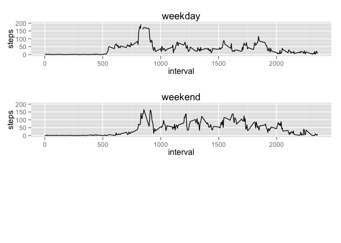

# Reproducible Research: Peer Assessment 1

### SECTION 1: Loading and preprocessing the data


```r
act = read.csv("activity.csv", stringsAsFactors=FALSE)
act$dateasDate = as.Date(act$date, format="%Y-%m-%d") 
str(act)
```

```
## 'data.frame':	17568 obs. of  4 variables:
##  $ steps     : int  NA NA NA NA NA NA NA NA NA NA ...
##  $ date      : chr  "2012-10-01" "2012-10-01" "2012-10-01" "2012-10-01" ...
##  $ interval  : int  0 5 10 15 20 25 30 35 40 45 ...
##  $ dateasDate: Date, format: "2012-10-01" "2012-10-01" ...
```

### SECTION 2: What is mean total number of steps taken per day? (can ignore NA in this part)

A list of the total number of steps taken per day is shown as follows. 

```r
library(dplyr)
options(dplyr.print_max = 1e9) # set dplyr to show all rows instead of only top 10
act %>% group_by(date) %>% summarize(steps_per_day = mean(steps)) %>% select(date, steps_per_day)
```

```
## Source: local data frame [61 x 2]
## 
##          date steps_per_day
##         (chr)         (dbl)
## 1  2012-10-01            NA
## 2  2012-10-02     0.4375000
## 3  2012-10-03    39.4166667
## 4  2012-10-04    42.0694444
## 5  2012-10-05    46.1597222
## 6  2012-10-06    53.5416667
## 7  2012-10-07    38.2465278
## 8  2012-10-08            NA
## 9  2012-10-09    44.4826389
## 10 2012-10-10    34.3750000
## 11 2012-10-11    35.7777778
## 12 2012-10-12    60.3541667
## 13 2012-10-13    43.1458333
## 14 2012-10-14    52.4236111
## 15 2012-10-15    35.2048611
## 16 2012-10-16    52.3750000
## 17 2012-10-17    46.7083333
## 18 2012-10-18    34.9166667
## 19 2012-10-19    41.0729167
## 20 2012-10-20    36.0937500
## 21 2012-10-21    30.6284722
## 22 2012-10-22    46.7361111
## 23 2012-10-23    30.9652778
## 24 2012-10-24    29.0104167
## 25 2012-10-25     8.6527778
## 26 2012-10-26    23.5347222
## 27 2012-10-27    35.1354167
## 28 2012-10-28    39.7847222
## 29 2012-10-29    17.4236111
## 30 2012-10-30    34.0937500
## 31 2012-10-31    53.5208333
## 32 2012-11-01            NA
## 33 2012-11-02    36.8055556
## 34 2012-11-03    36.7048611
## 35 2012-11-04            NA
## 36 2012-11-05    36.2465278
## 37 2012-11-06    28.9375000
## 38 2012-11-07    44.7326389
## 39 2012-11-08    11.1770833
## 40 2012-11-09            NA
## 41 2012-11-10            NA
## 42 2012-11-11    43.7777778
## 43 2012-11-12    37.3784722
## 44 2012-11-13    25.4722222
## 45 2012-11-14            NA
## 46 2012-11-15     0.1423611
## 47 2012-11-16    18.8923611
## 48 2012-11-17    49.7881944
## 49 2012-11-18    52.4652778
## 50 2012-11-19    30.6979167
## 51 2012-11-20    15.5277778
## 52 2012-11-21    44.3993056
## 53 2012-11-22    70.9270833
## 54 2012-11-23    73.5902778
## 55 2012-11-24    50.2708333
## 56 2012-11-25    41.0902778
## 57 2012-11-26    38.7569444
## 58 2012-11-27    47.3819444
## 59 2012-11-28    35.3576389
## 60 2012-11-29    24.4687500
## 61 2012-11-30            NA
```

While NA values are to be ignored in the current section, readers might prefer to render a list that hides all days with `NA` steps without using the 'dplyr' package:


```r
sumStep_perDay_tb = aggregate(steps ~ dateasDate, data=act, sum)
names(sumStep_perDay_tb) <- c("date", "steps_per_day")
sumStep_perDay_tb
```

A histogram of the total number of steps taken per day:

```r
library(ggplot2)
sumStep_perDay_tb = aggregate(steps ~ dateasDate, data=act, sum)
ggplot_Obj = ggplot(sumStep_perDay_tb, aes(x=steps))
ggplot_Obj + geom_histogram(binwidth=400) + ylim(c(0,7))
```

 

Notice that binwidth changes the general shape of the histogram dramatically. Readers may also consider to see the general shape of the histogram by the default setting: `ggplot_Obj + geom_histogram()`

The mean and median of the total number of steps taken per day are **10,770** and **10,760**, respectively:

```r
summary(sumStep_perDay_tb[,2]) 
```

```
##    Min. 1st Qu.  Median    Mean 3rd Qu.    Max. 
##      41    8841   10760   10770   13290   21190
```

### SECTION 3: What is the average daily activity pattern?

A time series plot of the 5-minute interval (x-axis) and the average number of steps taken, averaged across all days (y-axis):

```r
stepsByInterval = aggregate(steps ~ interval, data=act, mean)
ggplot_Obj = ggplot(stepsByInterval, aes(x=interval, y=steps))
ggplot_Obj + geom_line() 
```

 

On average across all the days in the dataset, the 5-minute interval, **835**, as shown below, contains the maximum number of steps:

```r
stepsByInterval[which.max(stepsByInterval$steps) ,]
```

```
##     interval    steps
## 104      835 206.1698
```

### SECTION 4: Imputing missing values
There are **2,304** NAs in the column steps:

```r
summary(act) 
```

```
##      steps            date              interval        dateasDate        
##  Min.   :  0.00   Length:17568       Min.   :   0.0   Min.   :2012-10-01  
##  1st Qu.:  0.00   Class :character   1st Qu.: 588.8   1st Qu.:2012-10-16  
##  Median :  0.00   Mode  :character   Median :1177.5   Median :2012-10-31  
##  Mean   : 37.38                      Mean   :1177.5   Mean   :2012-10-31  
##  3rd Qu.: 12.00                      3rd Qu.:1766.2   3rd Qu.:2012-11-15  
##  Max.   :806.00                      Max.   :2355.0   Max.   :2012-11-30  
##  NA's   :2304
```

Missing values are filled in based on non-missing values, using the Multiple Imputation by Chained Equations ([mice][mice]) package.

```r
library("mice")
```


```r
set.seed(100)
tempact = act[c("steps", "date", "interval")]  # to construct a temp df without any Date object
imputed_tempact = complete(mice(tempact)) # perform imputation
```


```r
summary(imputed_tempact) # without NA
```

```
##      steps            date              interval     
##  Min.   :  0.00   Length:17568       Min.   :   0.0  
##  1st Qu.:  0.00   Class :character   1st Qu.: 588.8  
##  Median :  0.00   Mode  :character   Median :1177.5  
##  Mean   : 37.08                      Mean   :1177.5  
##  3rd Qu.: 13.00                      3rd Qu.:1766.2  
##  Max.   :806.00                      Max.   :2355.0
```

All missing values are filled in. The new dataset, **imputed_fullAct**, that is equal to the original dataset but with the missing data filled in, is created:


```r
dateasDate = act$dateasDate
imputed_fullAct = cbind(imputed_tempact, dateasDate)
str(imputed_fullAct)
```

```
## 'data.frame':	17568 obs. of  4 variables:
##  $ steps     : int  0 0 47 10 0 0 0 0 0 0 ...
##  $ date      : chr  "2012-10-01" "2012-10-01" "2012-10-01" "2012-10-01" ...
##  $ interval  : int  0 5 10 15 20 25 30 35 40 45 ...
##  $ dateasDate: Date, format: "2012-10-01" "2012-10-01" ...
```

A histogram of the total number of steps taken each day is shown below:


```r
imputed_sumStep_perDay_tb = aggregate(steps ~ dateasDate, data=imputed_fullAct, sum)
names(imputed_sumStep_perDay_tb) <- c("day", "steps_per_day")

library(ggplot2)
ggplot_Obj_imputed = ggplot(imputed_sumStep_perDay_tb, aes(x=steps_per_day))
ggplot_Obj_imputed + geom_histogram(binwidth=400) + ylim(c(0,7))
```

 

Readers may also consider to see the general shape of the histogram by the default setting: `ggplot_Obj_imputed + geom_histogram()`

After imputation,  the mean and median total number of steps taken per day are **10,680** and **10,600**, respectively:

```r
summary(imputed_sumStep_perDay_tb[,2])
```

```
##    Min. 1st Qu.  Median    Mean 3rd Qu.    Max. 
##      41    8918   10600   10680   12880   21190
```

Comparing to the mean and median values (10,770 and 10,760) before imputation, 


```r
summary(sumStep_perDay_tb[,2])
```

```
##    Min. 1st Qu.  Median    Mean 3rd Qu.    Max. 
##      41    8841   10760   10770   13290   21190
```

After imputation, **both values decrese, and the median draws further away from the mean**.

### SECTION 6: Are there differences in activity patterns between weekdays and weekends?

A new column, **day**, is added to the imputated dataframe, imputed_fullAct:


```r
imputed_fullAct$day = weekdays(imputed_fullAct$dateasDate)
imputed_fullAct$day = gsub("Monday","weekday",imputed_fullAct$day)
imputed_fullAct$day = gsub("Tuesday","weekday",imputed_fullAct$day)
imputed_fullAct$day = gsub("Wednesday","weekday",imputed_fullAct$day)
imputed_fullAct$day = gsub("Thursday","weekday",imputed_fullAct$day)
imputed_fullAct$day = gsub("Friday","weekday",imputed_fullAct$day)
imputed_fullAct$day = gsub("Saturday","weekend",imputed_fullAct$day)
imputed_fullAct$day = gsub("Sunday","weekend",imputed_fullAct$day)
str(imputed_fullAct)
```

```
## 'data.frame':	17568 obs. of  5 variables:
##  $ steps     : int  0 0 47 10 0 0 0 0 0 0 ...
##  $ date      : chr  "2012-10-01" "2012-10-01" "2012-10-01" "2012-10-01" ...
##  $ interval  : int  0 5 10 15 20 25 30 35 40 45 ...
##  $ dateasDate: Date, format: "2012-10-01" "2012-10-01" ...
##  $ day       : chr  "weekday" "weekday" "weekday" "weekday" ...
```

A a panel plot containing a time series plot (i.e. type = "l") of the 5-minute interval (x-axis) and the average number of steps taken, averaged across all weekday days or weekend days (y-axis) is shown as folllow. 


```r
sub_weekday = subset(imputed_fullAct, day == "weekday")
stepsByInterval_wd = aggregate(steps ~ interval, data=sub_weekday, mean)
ggplot_Obj_skd = ggplot(stepsByInterval_wd, aes(x=interval, y=steps))
weekdayPlot = ggplot_Obj_skd + geom_line() + ylim(c(0,200)) + ggtitle("weekday")

sub_weekend = subset(imputed_fullAct, day == "weekend")
stepsByInterval_we = aggregate(steps ~ interval, data=sub_weekend, mean)
ggplot_Obj_swe = ggplot(stepsByInterval_we, aes(x=interval, y=steps))
weekendPlot = ggplot_Obj_swe + geom_line() + ylim(c(0,200)) + ggtitle("weekend")
```

The function `multiplot` is taken from: <http://www.peterhaschke.com/r/2013/04/24/MultiPlot.html>


```r
multiplot(weekdayPlot, weekendPlot, rows=2) 
```

 

[mice]: https://cran.r-project.org/web/packages/mice/index.html
